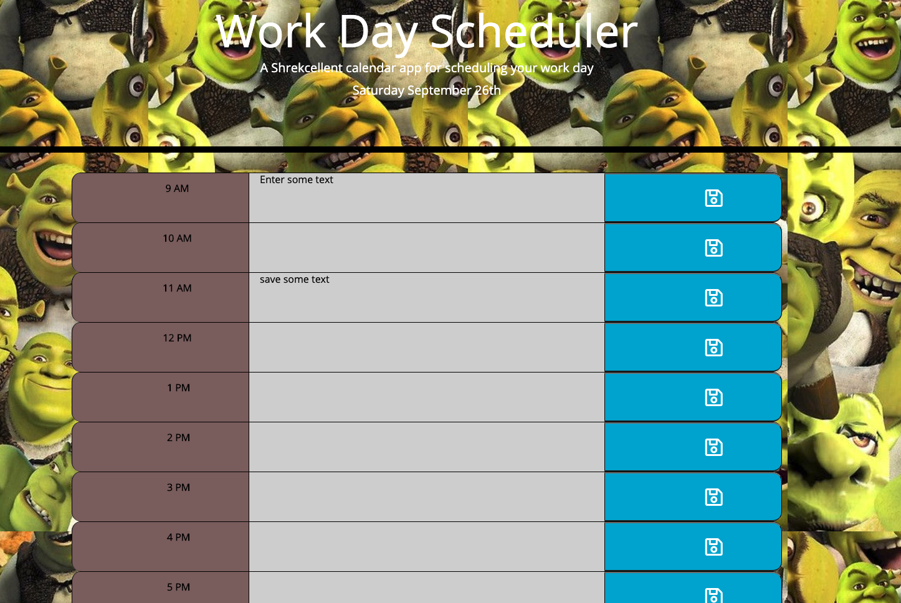

# homework5

## The task at hand

Our job here was to make a simple day planner app with some neat functionality. The workday planner needs to

* Cover standard 9-5 business hours
* Allow the input of text into each business hour
* These events should be saveable. 
* The planner should track the current time, and let you know where you are in the workday by dynamically updating the colour of each business hour

## How I got it done

## HTML

I started by referencing the completed example and building a grid using bootstrap elements in HTML. 
Because we needed to have 3 columns and 9 rows, I did this first.

I then looked at what the function of each column needed to be. 

Our leftmost column is going to show the hour of our workday, so I gave it a class of "timeblock". Because it's a bootstrap element, I gave it a sizing instruction of col. This will make sense later. I also gave it a value number, from 9-17. This will be used later extensively by our javascript for all functions.

Our middle column is going to be where the user inputs their text, so I first created a div element for it. I specified col-6 in bootstrap as I want this middle column to take up half of our grid's width.

Our rightmost column is going to be where our save button lives. Because our middle column is specified as half the width, and its bordering columns both have an equal class of col, they're size equally. I could have written col-3 specifically for them but it's always nice when you can remove unnecessary code! I gave it a saveBtn class that our javascript will be able to reference, then put in a save button icon from fontawesome. 

## CSS

Luckily, there was a lot of CSS provided. I had to add very little. Essentially I modified a couple of the items to my class names, and some of my own personal preferences in terms of colours, border radius etc. Our text area needed a little extra work to line up properly so I did that with my col-6 class and textarea styling.

## JavaScript

The first thing I did was get moment.js to display the time in the desired format at the top of the screen. I selected it through the DOM then added our moment.js code for the current date

`
 moment().format('dddd MMMM Do');
 `

Now I needed to build a function to pretty much do everything else. I've explained how it works pretty specifically in the javascript comments, but I'll list the steps below in plain English.

1. First I slected all our button elements.
2. I then had the program run through all of our button elements one by one.
3.  It adds an event listener to each button.
4. It checks the content of the text area and makes it a string
5. It gets the value of the time block
6. It then commits these items to local storage so they're saved.
7. It then does the same in reverse to pull them from local storage.
* It checks for our rowkey value by looking in the timeblock div and finding a value
* It assigns the rowKey number in local storage to the matching number in our timeblock div. 
*  It then assigns the string associated with the rowkey (the text) to the next sibling element, which is the text area.
8. Finally we use the same loop to compare the value of our timeblock to the current time in a 24 Hour clock, rounded to one digit (H). Thankfully we gave our value in the HTML in the same format, so we can directly compare these values by making them both whole numbers with the parseInt command.
9. We create 3 if conditions that assign a different color to each with our css by adding the corresponding class to each text box.

I'm actually pretty proud of this function since it gets everything done in one sweep through a for loop!

# Pics!!

I got the project done after work hours finished, so the color coding of the timeblocks wasn't available. However if you check the calendar between 9am-5pm you'll see text blocks for hours in the past are grey, present are red, and future are green!

